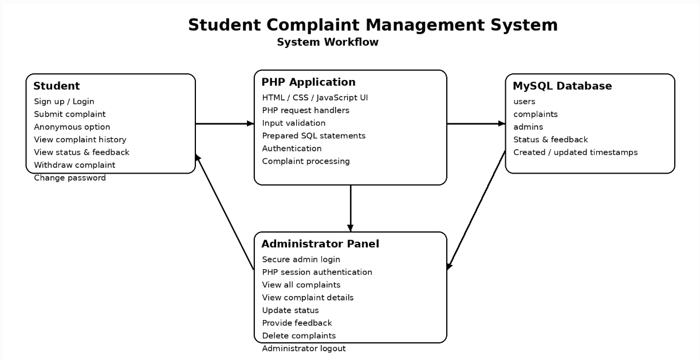

# Student Complaint Management System

A web-based Student Complaint Management System (SCMS) developed using HTML, CSS, JavaScript, PHP, and MySQL. The system provides separate interfaces for students and administrators to submit, manage, and track complaints.

---

## 1. System Overview

The Student Complaint Management System provides a structured platform for managing student complaints digitally.

### Student Module

- Student registration and login
- Complaint submission
- Anonymous complaint submission
- View submitted complaints
- View complaint details
- Track complaint status
- View administrator feedback
- Withdraw complaints
- Change password

### Administrator Module

- Secure administrator login
- Administrator dashboard
- View all complaints
- View complaint details
- Update complaint status
- Provide feedback
- Delete complaints
- Administrator logout

---

## 2. System Workflow

Student → Register/Login → Student Dashboard → Submit Complaint → PHP Backend → MySQL Database → Administrator Dashboard → Review Complaint → Update Status & Feedback → Student Views Status and Feedback

### Workflow Diagram

---

## 3. Technology Stack

| Technology | Purpose |
|---|---|
| HTML5 | Webpage structure |
| CSS3 | Styling and layout |
| JavaScript | Client-side functionality |
| PHP | Server-side processing |
| MySQL | Database management |
| XAMPP | Local development environment |
| phpMyAdmin | Database management |
| Git | Version control |
| GitHub | Repository and collaboration |

---

## 4. Database

**Database Name:** `scms_db`

### Users Table

Stores student account information.

- `id`
- `name`
- `email`
- `batch`
- `password`
- `created_at`

### Complaints Table

Stores submitted complaints and their processing information.

- `id`
- `user_id`
- `student_name`
- `batch`
- `is_anonymous`
- `title`
- `description`
- `status`
- `feedback`
- `created_at`
- `updated_at`

### Admins Table

Stores administrator account information.

- `id`
- `name`
- `email`
- `password`
- `created_at`

### Complaint Status

- `processing`
- `approved`
- `rejected`

---

## 5. Security

The system implements:

- Password hashing using PHP
- Password verification using `password_verify()`
- PHP session-based administrator authentication
- Prepared SQL statements
- User-specific complaint access
- Protected administrator operations

---

## 6. Project Structure

The project is organized into student pages, administrator pages, PHP backend files, and common frontend resources.

### Student Pages

- `home.html`
- `login.html`
- `signup.html`
- `submit-complaint.html`
- `my-complaints.html`
- `complaint-details.html`
- `profile.html`

### Administrator Pages

- `admin-login.html`
- `admin-dashboard.html`
- `admin-complaints.html`
- `admin-complaint-details.html`

### PHP Backend

- `db.php`
- `login.php`
- `signup.php`
- `submit-complaint.php`
- `get-my-complaints.php`
- `get-complaint.php`
- `change-password.php`
- `withdraw-complaint.php`
- `admin-login.php`
- `check-admin.php`
- `admin-logout.php`
- `get-all-complaints.php`
- `get-admin-complaint.php`
- `update-complaint.php`
- `delete-complaint.php`

### Other Files

- `script.js`
- `style.css`
- `README.md`
- `system-workflow.PNG`

---

## 7. Running the Project

### Step 1: Start XAMPP

Start:

- Apache
- MySQL

### Step 2: Place the Project

Place the project folder inside:

`C:\xampp\htdocs\SCMS`

### Step 3: Configure the Database

Open phpMyAdmin:

`http://localhost/phpmyadmin`

Create the database:

`scms_db`

Create the following tables:

- `users`
- `complaints`
- `admins`

### Step 4: Run the Application

Open:

`http://localhost/SCMS/`

> The project should be run through XAMPP Apache, not VS Code Live Server.

---

## 8. Team Contributions

| Member | Main Contribution |
|---|---|
| **S.M. Saleh Ahmed** | Student-side module, UI, and integration |
| **Sadiya** | Student complaint module and related functionality |
| **Farin** | Administrator module and authentication |
| **Farhana** | Complaint management operations and related backend |

---

## 9. GitHub Branches

The project uses separate branches for team members.

**Main Branch**

`main` — Complete integrated project

**Member Branches**

- `saleh`
- `sadiya`
- `farin`
- `farhana`

Individual branches contain the assigned work of each team member.

---

## 10. Project Status

**Completed Academic Project**

The system currently supports:

- Student registration and login
- Complaint submission
- Anonymous complaints
- Complaint tracking
- Complaint withdrawal
- Administrator authentication
- Complaint management
- Status updates
- Administrator feedback
- Complaint deletion
- Password management